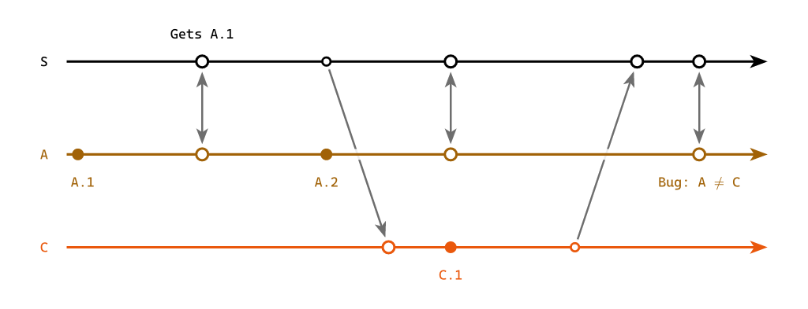

Lamport diagrams for replicated systems, as a [Typst](https://typst.app/) package: one horizontal timeline per replica, local events as dots on that timeline, and arrows for the messages that carry events from one replica to another.  The horizontal axis is logical time, in the sense of the clocks of [Time, Clocks, and the Ordering of Events in a Distributed System](https://lamport.azurewebsites.net/pubs/time-clocks.pdf).

> **Pre-1.0.**  This is young and still changing a lot.  Nothing here is a stable API until 1.0.0, so expect breaking changes between 0.x releases — argument names, defaults and the shape of what the helpers return are all still open.  A Typst import names an exact version, so nothing breaks under you: upgrading is always a deliberate edit.



That is [`gallery/gorgeous.typ`](https://github.com/mvaled/lamportian-dramatis/blob/main/gallery/gorgeous.typ), a complete standalone document and the worked example that ships with the package:

```typ
#import "@preview/lamportian-dramatis:0.2.0": lamport-diagram, sync, below, above, send, recv, replica

#set page(width: 13cm, height: auto, margin: 0.4cm)
#set text(size: 10pt)

#lamport-diagram(
  replicas: (
    replica("S", above, color: luma(0)),
    replica("A", below),
    replica("C", below),
  ),
  events: (
    "S": (
      sync("boot")[Gets `A.1`],
      send("c-reads"),
      sync("a-pushes"),
      recv("c-pushes"),
      sync("a-catches-up"),
    ),
    "C": (
      recv("c-reads"),
      [`C.1`],
      send("c-pushes"),
    ),
    "A": (
      [`A.1`],
      sync("boot"),
      [`A.2`],
      sync("a-pushes"),
      sync("a-catches-up")[Bug: $A != C$],
    ),
  ),
)
```

## Read on

- **[Guide]()** — how the columns are solved, how to read the marks, and how a diagram becomes a cross-referenced figure.
- **[Reference]()** — every function and every argument.
- **[Overlays]()** — drawing your own CeTZ into a diagram, addressing its own points, at a depth of your choosing.
- **[Changelog]()** — what each release changed, and what is waiting unreleased.

## Elsewhere

- [Package on Typst Universe](https://typst.app/universe/package/lamportian-dramatis/)
- [Source on GitHub](https://github.com/mvaled/lamportian-dramatis)
