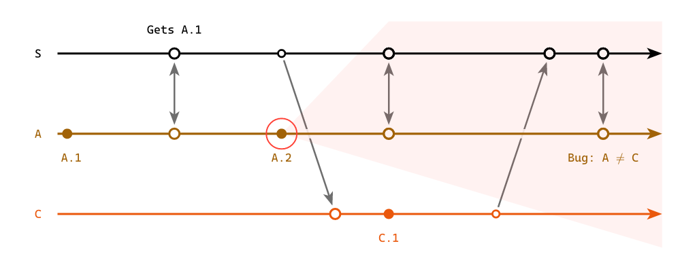

# `overlays`

An escape hatch for drawing arbitrary [CeTZ](https://typst.app/universe/package/cetz/) into a diagram, in the diagram's own coordinates, addressing the diagram's own points — and at a chosen depth, so a drawing can sit behind what the diagram draws as readily as in front of it.

```typ
lamport-diagram(
  caption: none,
  replicas: (),
  events: (:),
  orientation: horizontal,
  overlays: none,
  ...
)
```

## Shape

`overlays` takes `none`, a bare CeTZ body, a function of one argument — the *locator* — returning a CeTZ body, or a dictionary from layer name to either of those.  A body or a function on its own goes in the `foreground`, that being what you want when you have not thought about depth.

```typ
// nothing
overlays: none

// a bare body, for when you need no points -- drawn in foreground
overlays: { grid((0, 0), (8, -3)) }

// a function, for when you want the diagram's points -- drawn in foreground
overlays: d => {
  let (mark, ..) = d
  circle(mark("A", "bad"), radius: 0.3, stroke: red)
}

// a dictionary, for when layering matters
overlays: (
  backdrops: d => { ... },
  marks: d => { ... },
)
```

Everything is spliced into the diagram's own `cetz.canvas`, so a coordinate is a canvas centimetre and every CeTZ coordinate form — `rel:`, `to:`, anchors on elements you name yourself — works as it does anywhere else.  It all runs inside the same `context` the diagram uses, so `measure` is available.

Your body is written in your own file, though, so the drawing commands have to be in scope there.  The package re-exports the CeTZ module it draws with, which saves pinning a second dependency and keeps the two versions in step:

```typ
#import "@preview/lamportian-dramatis:0.2.0": draw

overlays: (
  marks: d => {
    import draw: *          // inside the body, so `circle` and `rect` go no further
    ...
  },
)
```

`#import draw: *` at the top of the file works as well, if you would rather have them everywhere.  The locator carries that same module under `draw`, so a body can take it from there and import nothing at all — `let (draw, mark, ..) = d`, and then `draw.circle(..)`.

The locator is a dictionary; unpack the entries a layer needs and call them.

## Layers

A diagram is drawn in a fixed sequence of passes: the arrows first, then the backdrops that erase them wherever a lane crosses, then the timelines, then the marks, then the labels.  Each pass is a **layer**, and each key of `overlays` names one.

An overlay given for a layer is **appended to that layer's pass** — after everything the diagram itself draws there, and before anything in any later pass.  So `arrows: ...` draws with the contents of the layer "arrows": over them, under everything that follows.  That is the whole rule.

`background` and `foreground` are not passes of the diagram.  They are bookends that exist only for overlays, one before the first pass and one after the last, and whatever you put there is all they hold.

Bottom to top:

| Layer | Content | Usage in `overlays` |
| --- | --- | --- |
| `background` | -- | a wash behind the whole diagram, striped by the backdrops like everything under them |
| `arrows` | the message and `sync` arrows, and their labels | annotating one arrow, with the lanes still passing over your drawing the way they pass over its arrow |
| `backdrops` | the translucent white band that fades an arrow wherever a lane crosses it | a fill that comes out even rather than striped, still under every lane |
| `timelines` | the lane lines and the replica names | something along a lane that the lane's own dots sit on top of |
| `marks` | the dots | a ring round a dot that the dot's own label stays readable over |
| `labels` | the event labels, and the labels on the ends of a message | something belonging with the labels, over them but still under anything in `foreground` |
| `foreground` | -- | the last word: annotation read over the whole drawing, this layer included |

The order is the table's, never the dictionary's: a dictionary that happens to list `foreground` first still draws it last.  A key that is not a layer fails compilation, and says which names are.

`labels` and `foreground` land next to each other, the diagram drawing nothing between them, and they are still two layers rather than one: give both and `labels` draws first.  What separates them is not what lies between but what they mean — `labels` joins the diagram's own last pass, `foreground` sits above everything, that pass included.

### The layers are part of the API

Their names and their order are not an internal detail to be read off this page.  `layers` is the ordered array of them, bottom to top, and the package exports it:

```typ
#import "@preview/lamportian-dramatis:0.2.0": layers

#layers
// ("background", "arrows", "backdrops", "timelines", "marks", "labels", "foreground")
```

They are plain strings, as orientations are, so `overlays: (marks: ...)` needs no import.  `layers` is for when you want to check a name, walk the stack, or build an `overlays` dictionary out of something that is not a literal.

Exposing them settles what would otherwise be a matter of taste: which layers to offer.  The answer is all of them, because the array claims to be how the diagram is drawn.  `timelines` earns its place not by being useful — a dashed line along a lane is the only use I can name for it — but by being a pass; leaving it out would make `layers` a curated list of good ideas rather than a description, and the reader could no longer trust the order.

### `arrows` and `backdrops` are not the same place

They sound like one place — "just above the arrows", "just under the lanes" — and the difference between them is most of why the layers are worth having.

What makes an arrow pass *behind* a lane is a translucent white band.  Before any lane is drawn, the diagram strokes white at 88% opacity, five points wide, along every lane, and lays a disc of the same under every mark.  That is the `backdrops` pass.  On a white page the band shows nowhere it has nothing to cover; where it crosses an arrow it leaves a tenth of that arrow showing, which reads as the arrow running underneath rather than as a gap cut in it.

So nothing is washed by *the lanes*.  Things are washed by that band, and whether yours is washed depends only on which side of it you drew:

- At `background` or `arrows` you draw first and the band goes down over you.  A fill comes out with a paler five-point stripe along every lane — the same fading the arrows get, and it keeps its hue, since the band is translucent rather than a lid.
- At `backdrops` the band is already down and you draw over it.  A fill covers page and band alike, so it comes out even — and still sits under the timelines, the marks and the labels, all of which come later.

Which you want depends on what the drawing means.  A note belonging to one arrow reads better at `arrows`, breaking around the lanes the way its own arrow does.  A band standing for a stretch of time belongs at `backdrops`: it is not something the lanes should be in front of, it is the ground they stand on.

(The band is white whatever the page is.  Give the page a `fill` other than white and every lane will show as a pale stripe across it, because the band was only ever invisible by matching the white it was drawn on.)

## Addressing a point

Every point on a lane is `(replica, id)`.  An id need only be unique *within its own lane*, which is what lets a `sync`'s two ends and a message's two ends keep the name that pairs them:

```typ
mark("A", "bad")        // an event, by the id it was given
mark("S", "a-pushes")   // this end of the sync;  mark("A", "a-pushes") is the other
mark("C", "c-pushes")   // the send;  mark("S", "c-pushes") is its recv
```

`send`, `recv` and `sync` already carry a name, and that name is their id.  A local `event` has none, so it takes one:

```typ
"A": ([`A.1`], event(id: "bad")[`A.2`], sync("a-pushes")),
```

Ids are opt-in on purpose.  The alternative — addressing an event by where it sits, `A.0`, `A.1`, … — would put back exactly the fragility that solving the columns removed: insert one event and every drawing below it points silently at the wrong dot.  An id you wrote survives the insert.

Two points on one lane may not share an id, and that is an error rather than a silent win for whichever came first.

### By index

Anywhere an id is taken an integer is taken too, addressing the lane positionally, **1-based**, counting *every* item in the lane's array including `gap` and `idle`.  It numbers the array and nothing else — the columns the solver hands out count from `0`, so the first item on a lane is index `1` and column `0`:

```typ
mark("A", 1)      // the lane's opening item
mark("A", 3)
mark("A", -1)     // the last item -- the one index that survives an insert
column("B", 2)    // and the same wherever else a point is asked for
```

Ids are strings and indices are integers, so the two never need telling apart by hand.  An index is what to reach for when naming a one-off is not worth it — bearing in mind that it moves when you insert an event above it, which is exactly what an id does not do.

## What the locator holds

Five kinds of value pass through the locator, and it is worth keeping them apart.

- A **time** is a position along logical time, measured in columns.  It is a real number and may be any of them: `2.5` falls halfway between two columns, `-0.09` falls before the diagram's first one.
- A **column** is one of the whole times the solver hands out, `0` up to `ncols - 1`.  Every column is a time; most times are not columns.  This is the discrete thing the layout reasons about, and the only kind that can answer "did these two land at the same moment".  Columns count from `0`, so a lane's opening point sits in column `0` unless a message it receives pushes it later.  That is not the numbering an index uses: `column("A", 1)` says "the first item written on A", by an index counting from `1`, and answers `0`, the column the solver put it in.  An index says where in the lane's array a point stands; a column says when it happens.
- A **lane** is a position across the replicas, measured in lanes, and likewise a real number: `0` is the first replica, `1` the second, `0.5` between them, and `-0.4` a little to the outside of the first.  It is a position and not an index, so `-1` is one lane clear of the first rather than the last one; for that, ask `replicas` how many there are.  A replica id is accepted wherever a lane is.
- A **coordinate** is a CeTZ point, `(x, y)` in canvas centimetres.  It is what every CeTZ function wants, and the only kind here that knows which way the diagram runs.
- A **rectangle** is a pair of coordinates — two opposite corners — handed back as `arguments`, so it spreads straight into `rect`.  It is measured off what the diagram actually drew, and it takes a `pad` that grows it.

A time and a lane together make a coordinate, and `point` is the one entry that does that conversion.  Everything else either hands you a coordinate outright or stays in times and lanes, where it survives a change of orientation.  A rectangle hands out coordinates and survives it too, because what fixes one is the part of the diagram it is asked for and the pad it is grown by, and neither of those is a position on the page.

### `mark(replica, id-or-index)`

Return the CeTZ coordinate `(x, y)` of the mark the diagram drew for that point — a local `event`, or either end of a `send`, `recv` or `sync`.  It includes the sub-column `displacement` that leans an arrow off a straight run across the lanes, so it is where the dot really landed rather than where its column nominally is.

A coordinate has a lane baked into it: the lane of the replica you named.  That is the whole difference from `column`, and it is what makes `column` the one to reach for when a drawing crosses lanes.

### `mark-args(replica, id-or-index)`

Return everything the diagram used to draw that mark — its coordinate, radius, fill and stroke — as `arguments` ready to spread into `circle`.  A `gap` or an `idle` draws no mark, so for those it returns `none`.

It is for restating a mark rather than placing something near it.  Spread it and override what you want changed; a later argument wins, so the rest stays whatever the diagram chose:

```typ
overlays: (
  marks: d => {
    import draw: *
    let (mark-args, ..) = d
    // Tint three marks, keeping the radius and the ring the diagram gave them.
    for point in (("S", 3), ("S", 4), ("A", "a-catches-up")) {
      circle(..mark-args(..point), fill: red.transparentize(55%))
    }
  },
)
```

The diagram draws its own marks from exactly this, which is the point of it: a hollow ring for a point where the replica touches the network, a solid dot for a purely local step, a send drawn smaller than the receive it feeds.  None of that has to be restated, and a drawing that spreads `mark-args` follows the library if any of it ever changes.

### `column(replica, id-or-index)`

Return the column the solver put that point in: a whole number, `0` up to `ncols - 1`.  It carries no lane and no displacement — it is the moment, and nothing about where on the page that moment was drawn.

`mark` and `column` ask the same question and answer in different kinds, and that is the whole distinction.  You want the column whenever what you are drawing crosses lanes, because a coordinate is already on a lane.  A column is a time, so it goes straight into `point`:

```typ
overlays: (
  backdrops: d => {
    let (column, point, replicas, ..) = d
    let last = replicas.len() - 1
    rect(
      point(column("C", "c-reads"), -0.4),
      point(column("A", "a-catches-up"), last + 0.4),
      fill: yellow.transparentize(85%),
      stroke: none,
    )
  },
)
```

`mark("C", "c-reads")` cannot start that rectangle: it sits on C's lane, not on the first one.  So the two compose — `column` gets the moment, `point` puts it on whichever lane you meant.

`column` is also what to reach for when you want to *reason* rather than draw.  `column("A", "x") == column("B", "y")` is "the solver found nothing ordering these two", which is a real question to ask of a Lamport diagram.

### `point(time, lane)`

Return the coordinate of a time on a lane.  Both arguments are the kinds above: `time` is a number of columns, whole or not, and `lane` is a number of lanes, or the id of the replica on one.

It is the entry that turns a time and a lane into a position on the page, which is what makes it the one to write a drawing in terms of — see [staying orientation-independent](#staying-orientation-independent) below.

### The rectangles

The five that follow answer with two opposite corners, so each spreads straight into `rect` — or into anything else that takes two, `content` included.  Naming that `rect` leaves CeTZ holding the anchors, which is what lets a note be hung off the box instead of off a position worked out by hand:

```typ
overlays: (
  foreground: d => {
    import draw: *
    let (gap-rect, ..) = d
    rect(..gap-rect("R1", 3, pad: (0, 0.14)), stroke: (paint: gray, dash: "densely-dotted"), name: "elided")
    content("elided.north", anchor: "south", text(fill: gray, [elided time]))
  },
)
```

`pad` grows a rectangle on every side, in canvas centimetres.  One number pads all four the same; a pair pads in the diagram's own axes — how far along the timelines, how far across them — which is what keeps a padded box the same box when the diagram is turned on its side:

```typ
gap-rect("R1", 3)                  // exactly the dotted span, and nothing more
gap-rect("R1", 3, pad: 0.1)        // a millimetre of air on every side
gap-rect("R1", 3, pad: (0, 0.14))  // tight in time, standing clear of the lane
```

Unpadded, a rectangle is exactly the part it names, and that is what makes it worth asking for: the diagram sets its names into the very box `names-rect` hands out, interrupts a lane over the very stretch `gap-rect` answers with, and runs its arrows between the very points `arrow-mid` takes the middle of.  None of it is re-derived, so none of it can drift.

### `lane-rect(lane, pad: 0)`

Return the rectangle round the whole strip a lane occupies: from where its line leads in to past the arrowhead, and as thick across as the band the lane erases behind itself.  It holds every mark on that lane and no label off it, and it stops short of the replica name, which has `names-rect` of its own.

### `gap-rect(replica, index, pad: 0)`

Return the rectangle round exactly the dotted span of one `gap`, as thick across as its lane.  A `gap` carries no id, so name it by its index on the lane — a negative one counting back from the end.  Naming a point that is not a `gap` fails compilation, saying which kind it found there.

### `names-rect(pad: 0)`

Return the rectangle round the strip the replica names are set in: the column the diagram keeps clear before the lanes begin.  Given a replica — `names-rect("A")` — it is that one name's own box instead.

### `arrow-rect(name, pad: 0)`

Return the rectangle round a message or a `sync`, by the name that pairs its two ends: the shaft together with both the marks it runs between, so a box drawn round an exchange reads as round the exchange rather than round the gap in the middle of it.

### `arrow-mid(name)`

Return the coordinate of the middle of that arrow's shaft — where the diagram sets an arrow's own label, before stepping it off the shaft.  A note hung here hangs where a label would have.

### `color-of(replica)`

Return the colour that replica's timeline and marks are drawn in, so a drawing can match a lane rather than restate its colour.  A lane between two replicas has none, so this takes a replica and not a lane.  Next to `mark-args` it is the smaller tool: for when you want a lane's colour and nothing else.

### `span`

Two times: the one each lane's line starts at, and the one it ends at.  The first is slightly negative, because a lane leads in a little before column `0`; the second is past `ncols - 1`, because the line runs on beyond the last mark to carry its arrowhead.  Neither is a column, which is what the distinction above is for.  Every lane is drawn over the same stretch, so there is one pair for the whole diagram and no replica to ask about.

### `replicas`

The replica ids, in order.  The id at index `n` is the replica on lane `n`, which is how a drawing turns an id into a lane when it needs to arrive at one by arithmetic.

### `ncols`

How many columns the diagram was solved into, so the last of them is `ncols - 1`.

### `orientation`

Which way this diagram runs, as its canonical name: `rightwards`, `leftwards`, `downwards` or `upwards`.  The two shorthands resolve to the direction they stand for, so a drawing that tests this never has to test for `horizontal` or `vertical` as well.

### `draw`

The CeTZ module the diagram draws with — the same one the package re-exports, for a body that would rather unpack it than import it: `let (draw, mark, ..) = d`, and then `draw.circle(..)`.

### `col-gap`, `row-gap`, `dot`

The diagram's own measurements, in canvas centimetres: one column of time, one lane, and the radius of an event's dot.

They are here so a drawing can speak the diagram's own language.  A brace half a column clear of the last mark stays half a column clear when you retune `col-gap`; one written as `+1.0` does not.

## Staying orientation-independent

`point(time, lane)` is stated in the diagram's own axes — logical time along the lanes, and lanes across it — so a drawing written in terms of it survives a flip from `horizontal` to `vertical`.  One written against raw `(x, y)` arithmetic does not:

```typ
let (point, ..) = d
line(point(2, "A"), point(2, "C"))   // flips cleanly
line((4, 0), (4, -3))                // does not
```

Fractional lanes are what make this work for nudges too.  "Just off the lane, towards the next one" is `point(c, 0.15)` whichever way the diagram runs, where a page-space `(0, -0.3)` would point the wrong way the moment it turned.

`span` stays in times for the same reason, and it is what lets a drawing run the full length of a lane without knowing where on the page that lane falls:

```typ
overlays: (
  timelines: d => {
    let (span, point, ..) = d
    let (s, e) = span
    line(point(s, "B"), point(e, "B"), stroke: (paint: red, dash: "dashed"))
  },
)
```

That line lies along the lane, so the layer decides whether it shows at all: at `backdrops` the lane's own stroke would cover it, at `timelines` it is drawn over that stroke instead.  To sit *beside* the lane rather than on it, feed the same span to a fractional lane — `point(s, 1.12)` to `point(e, 1.12)` — which is the pairing coordinates would not have allowed.

## Errors

- An unknown replica id, an unknown point id, or an index past the end of a lane fails compilation, naming what was asked for and what that lane actually holds.
- Two points on one lane sharing an id fails compilation.
- `gap-rect` given a point that is not a `gap` fails compilation, naming the kind it found there.  An arrow name that is neither a message nor a `sync` fails the same way.
- A `pad` that is neither a number nor a pair of them fails compilation.
- A layer name that is not in `layers` fails compilation, and says which names are.
- An `overlays` that is none of `none`, a dictionary, a function of one argument, or a CeTZ body fails compilation.

## Worked example



That is [`gallery/overlays.typ`](https://github.com/mvaled/lamportian-dramatis/blob/main/gallery/overlays.typ): the future cone of `A.2`, drawn at `backdrops` so the lanes cross it without fading a stripe through it, and a ring at `marks` so `A.2`'s own label stays legible over it.

```typ
#import "@preview/lamportian-dramatis:0.2.0": lamport-diagram, replica, event, send, recv, sync, above, below, draw

#lamport-diagram(
  replicas: (replica("S", above, color: luma(0)), replica("A", below), replica("C", below)),
  events: (
    "S": (sync("boot"), send("c-reads"), sync("a-pushes"), recv("c-pushes"), sync("a-catches-up")),
    "C": (recv("c-reads"), event(id: "c1")[`C.1`], send("c-pushes")),
    "A": ([`A.1`], sync("boot"), event(id: "a2")[`A.2`], sync("a-pushes"), sync("a-catches-up")),
  ),
  overlays: (
    // The future cone of `A.2`: the part of the diagram that event can still reach.  It opens one
    // lane per column from where the event happened, and once it has taken in every replica there is
    // nothing left to open into, so it runs on as a band.  Over the backdrops, so the lanes do not
    // fade a stripe through it, and still under every timeline.
    backdrops: d => {
      import draw: *
      let (column, point, replicas, span, ..) = d
      let (_, ends) = span
      let t = column("A", "a2")
      let lane = replicas.position(r => r == "A")
      let edge = replicas.len() - 1 - lane + 0.4
      let wash = red.transparentize(93%)
      line(
        point(t, lane),
        point(t + edge, lane - edge),
        point(t + edge, lane + edge),
        close: true,
        fill: wash,
        stroke: none,
      )
      rect(
        point(calc.min(t + edge, ends), lane - edge),
        point(ends, lane + edge),
        fill: wash,
        stroke: none,
      )
    },
    // Over the dot, under its label.
    marks: d => {
      import draw: *
      let (mark, dot, ..) = d
      circle(mark("A", "a2"), radius: dot * 3, stroke: red + 0.7pt)
    },
  ),
)
```

## The legend on the guide

The legend at the top of the [guide]() is the other worked example: [`gallery/legend.typ`](https://github.com/mvaled/lamportian-dramatis/blob/main/gallery/legend.typ) names each part of a diagram with a rectangle from the table above, or with a ring built out of `mark` and `dot`, and hangs a note off it.  The callouts are drawn at `foreground`, so they read over the whole diagram; the rings at `marks`, so each dot's own label stays legible over the ring round it.
