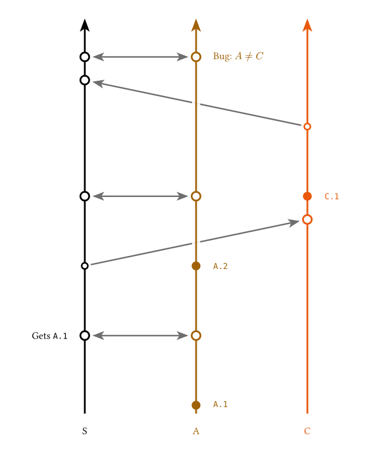

# Reference

Everything here is in **0.1.0**, the published release, except entries marked *unreleased* — those are on `main` and land in the next version.  A Typst import names an exact version, so a diagram only ever sees the API it asked for.

## `lamport-diagram`

```typ
lamport-diagram(
  caption: none,
  replicas: (),
  events: (:),
  orientation: horizontal,   // unreleased
  col-gap: 2.0,
  row-gap: 1.5,
  text-size: 0.62em,
  dot: 0.095,
  message-stroke: 0.9pt + luma(110),
)
```

`replicas` fixes the row order, top to bottom.  Each entry is an id string, a [`replica`](#replica) — which also carries that lane's event defaults — or a bare dictionary of the same fields.

`events` maps each replica id to that replica's local history in order.  An entry is bare content or a bare string for a local event, or one of [`event`](#event), [`send`](#send-and-recv), [`recv`](#send-and-recv), [`sync`](#sync), [`idle`](#idle) and [`gap`](#gap).  Every replica must have an entry, and every entry must name a declared replica.

With a `caption` the result is a `figure`; without one it is the bare drawing, to place inside a `figure` of your own.  `col-gap` and `row-gap` are canvas centimetres, and are the knobs for a diagram that reads too cramped or too sparse.

## `orientation`

> **Unreleased.**  Not in 0.1.0 — this is on `main` and lands in the next release.  See the [changelog]().

```typ
horizontal   // = rightwards
vertical     // = downwards
rightwards   leftwards   downwards   upwards
```

Which way logical time runs.  `rightwards` and `leftwards` lay the timelines out as rows and stack the replicas downwards; `downwards` and `upwards` lay them out as columns and stack the replicas rightwards.  `horizontal` and `vertical` are the two that need no thinking about, and are `rightwards` and `downwards` under a shorter name.  These are plain strings, so `orientation: "vertical"` works without importing anything.

The orientation decides which sides a label may sit on, and which one it sits on by default:

| Orientation | Sides | Default |
| --- | --- | --- |
| `horizontal`, `rightwards`, `leftwards` | `above`, `below` | `above` |
| `vertical`, `downwards`, `upwards` | `left`, `right` | `right` |

A side the orientation has no room for — `above` on a vertical diagram, `left` on a horizontal one — is *not* an error: it is dropped back to that default, and a warning naming the replica and the item is printed above the diagram.  So flipping a finished diagram from horizontal to vertical is one edit, and the sides that no longer make sense say so instead of stopping the compile.  (Typst gives user code no way to reach the compiler's own warnings, hence a printed one.)



That is [`gallery/vertical.typ`](https://github.com/mvaled/lamportian-dramatis/blob/main/gallery/vertical.typ).

## `replica`

```typ
replica(name, ..defaults)
```

A replica lane, and the defaults the local events on it fall back on.  `name` is the id that the `events` dictionary keys on.

- `label` — what the diagram prints for the lane.  Defaults to `name`.
- `color` — the lane's colour.  Defaults to the next entry of `default-palette`, cycled over `replicas` in order.
- `position` — `above` or `below`, the side of the timeline this lane's event labels sit on.  *Unreleased:* on a vertical diagram these are `left` and `right` instead; see [`orientation`](#orientation).
- `size` — the text size of this lane's event labels.
- `displacement` — how far this lane's event labels slide off their own dot.
- `first-displacement` — the same, for the lane's opening event, the one that would otherwise crowd the replica name.

`label`, `color` and `position` may also be given positionally, in any order: they are told apart by type, so `replica("A", below, red)` and `replica("B", red, below)` are the same lane.  The rest must be named.

None of these defaults reach a `send` or `recv` label: those keep their own arguments, and their side is chosen to stay clear of the message arrow.

## `event`

```typ
event(..args)
```

A local event on a replica's timeline.  Its body is the label — content or a plain string.

- `position` — `above` or `below` the timeline.  *Unreleased:* `left` or `right` on a vertical diagram; see [`orientation`](#orientation).
- `size` — the label's text size.
- `displacement` — slides the label along the timeline, out of being centred on its own dot.  A ratio is taken against the label's own width, so `+50%` leaves the label's left edge over the dot and `-50%` its right edge, while a length is an exact offset and `0` (or `0%`) centres it.  *Unreleased:* on a vertical diagram the ratio is taken against the label's height, that being what runs along the timeline there.
- `width` — wraps the label to a fixed width instead of letting it run along the timeline on one line, which is what keeps a long label from crowding its neighbours.  **Named only**: a bare length is read as a `displacement`, that being the far commoner one to reach for.  The box is centred on the mark like any other label, and its contents are left to you — wrap the body in `align(center, ..)` if centred lines read better than the ragged right edge.
- `halo` — how far the label's backdrop reaches past the label's own box, which is what breaks an arrow crossing the lane so it does not crowd the glyphs.  `auto` (the default) matches the reach of the disc under a mark, so a label and a dot break an arrow by the same amount; a length sets an exact reach, and `none` drops the backdrop, letting whatever is behind show through.

The dot itself never moves: it is the event's place in time, which the layout solves for.

Arguments are told apart by type, so they may come in any order and every one of them is optional: `event(below, +50%)[AddFile1]` and `event(+50%, below, "AddFile1")` are the same event.  For the common case of a label and nothing else, bare content or a bare string in an `events` array is shorthand, so `[AddFile1]`, `"AddFile1"` and `event[AddFile1]` are the same event too.

## `send` and `recv`

```typ
send(name, ..args)
recv(name, ..args)
```

The points where the message `name` leaves one replica and is applied on another.  Exactly one `send` and one `recv` must exist for each name.

An optional label for the point goes positionally — `send("push")[pushed]`, `recv("pull")[now duplicated]` — or as `body`, with `size` setting its text size and `at` overriding the side it sits on.

Both take `displacement`, which nudges the point off the column it is solved into, in either direction.  A ratio is taken against the column gap.  Only the defaults differ:

- on a `recv` it is `1cm` — how far right of its `send` the point lands whenever nothing on its own replica pushes it further, and enough to lean the arrow forward.  `recv(..., displacement: none)` leaves it on its column, drawing a vertical arrow when the receiving replica has nothing else competing for that column.
- on a `send` it is `none` — a send sits on its own column unless you say otherwise, since it is the receive that leans a message forward.  Reach for it to tilt an arrow away from whatever a vertical line would otherwise run through, or to separate two sends the solver put in one column.

`send` also takes:

- `label` — labels the arrow itself rather than the point, and keeps its own styling.
- `delay` — the minimum number of columns the matching `recv` is pushed forward.  `0` (the default) leaves the two in one column, where the receive's own `displacement` is what leans the arrow forward; `1` or more buys the message a whole column of flight.

The nudge is a drawing offset the column solver knows nothing about, so a negative one wide enough to put a point visually behind its own counterpart does *not* trip the causal-cycle check.  It is equally outside what the drawing sizes itself to, so a displacement large enough to push a bodiless mark left of where its lane starts will leave it overhanging the replica name.

## `sync`

```typ
sync(name, ..args)
```

One end of a two-way exchange.  In a single round trip each side gives the other the events it lacks, so both ends come out of the exchange holding the same events — which is not the same as holding the same state, so each end takes its own label.  A `send`/`recv` pair is the one-way message by comparison.

Exactly two `sync` points must carry the same name, and they must sit on two different replicas.  The pair is drawn as one arrow with a head at each end, and the two ends share a column: neither side can finish the exchange before the other one starts it.  A name cannot be both a `sync` and a `send`/`recv` message.

An optional label for the point goes positionally — `sync("push")[rolled back]` — or as `body`, with `size` setting its text size and `at` forcing the side the label sits on.  `label` instead labels the arrow itself; either end may carry it, and the first one given wins.  `displacement` nudges this end off the shared column, which tilts the arrow away from whatever the vertical line would otherwise run through; it is a drawing offset and says nothing about the order.

```typ
#lamport-diagram(
  replicas: ("Client A", replica("Server", below), replica("Client B", below)),
  events: (
    "Client A": ([Edit], sync("first", label: "round trip"), idle(2), sync("third")[has both edits]),
    "Server": (sync("first"), sync("second"), idle(1), sync("third")),
    "Client B": (idle(1), [Edit], sync("second")[has both edits]),
  ),
)
```

## `idle`

```typ
idle
idle(n)
```

Spacing to convey idle time passing: `n` columns of ordinary timeline with nothing drawn on them.  The specific semantics are for the author to explain.  The solver counts them, so the next event on this lane lands `n` columns later.

Usable bare or called, so `idle`, `idle()` and `idle(2)` are the same thing: two columns is enough for the stretch to read as a pause rather than as the ordinary spacing between two events.

`gap` is the sibling that *shows* the stretch, with dots, for time the diagram elides; `idle` shows nothing, because nothing happened.

## `gap`

```typ
gap
gap(size)
```

Elided time: a stretch of dotted timeline standing for events the diagram does not show, taking one column of its own.  The size is how much of that column the dots span — `"small"`, `"medium"` (the default) or `"large"`, or a length or a ratio of the column gap for an exact span, which past a full column runs into the neighbouring marks.

Usable bare or called, so `gap`, `gap()` and `gap("medium")` are the same thing.

## `above` and `below`

These are `top` and `bottom` under names that read better for a diagram of one horizontal line per replica, and they *are* those same values, so either spelling works wherever a side is asked for.

*Unreleased:* `left` and `right` are re-exported alongside them, so one import line covers every side a diagram may ask for whichever way it runs.  They are the built-in alignments of those names.

## `default-palette`

The lane colours, cycled over `replicas` in order.  Override per replica with `replica("A", red)`.

## Dependencies

Drawing is done with [CeTZ](https://typst.app/universe/package/cetz/) 0.5.2.  The minimum Typst compiler is 0.14.0.
